<p align="center">
  
</p>

<h1 align="center">EthioWorks</h1>

<p align="center">
  <b>A Modern, Responsive Job Matching Platform for Ethiopia</b>
</p>

---

## 🌟 Overview

EthioWorks is a state-of-the-art job portal designed to bridge the gap between talented job seekers and leading employers in Ethiopia. Built with Flutter, the platform offers a seamless, high-performance experience across Mobile, Web, and Desktop, featuring a truly responsive design that adapts to any screen size.

## ✨ Key Features

### 👤 For Job Seekers
- **Dynamic Home Feed**: Discover the latest job openings tailored to your interests.
- **Advanced Search & Filtering**: Find the perfect role by category, location, or job type.
- **Easy Applications**: Apply to jobs with just a few taps and manage your application history.
- **Company Profiles**: Explore detailed information about hiring companies.
- **Premium UI**: Experience a modern, glassmorphic design that makes job hunting enjoyable.

### 🏢 For Employers
- **Job Management**: Post, edit, and manage job listings with ease.
- **Applicant Tracking**: View and manage candidate profiles and their applications in a dedicated dashboard.
- **Smart Sidebar**: Navigate through your recruitment tools with a modern, integrated sidebar on desktop.
- **Real-time Stats**: Track your posting performance and applicant numbers at a glance.

## 📱 Mobile Experience

The mobile application is optimized for on-the-go browsing, featuring a sleek bottom navigation bar and intuitive gestures.

<p align="center">
  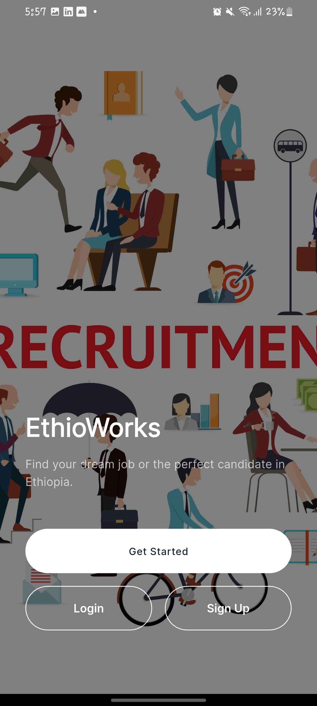
  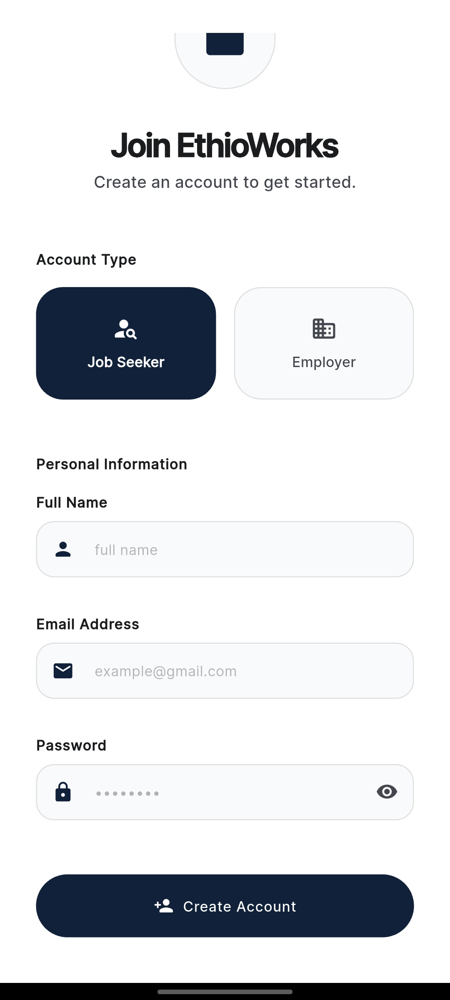
  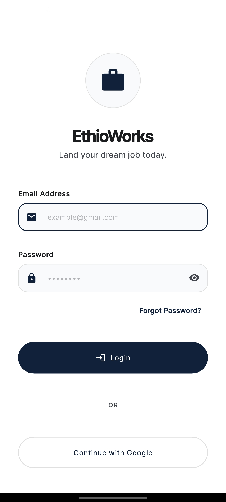
  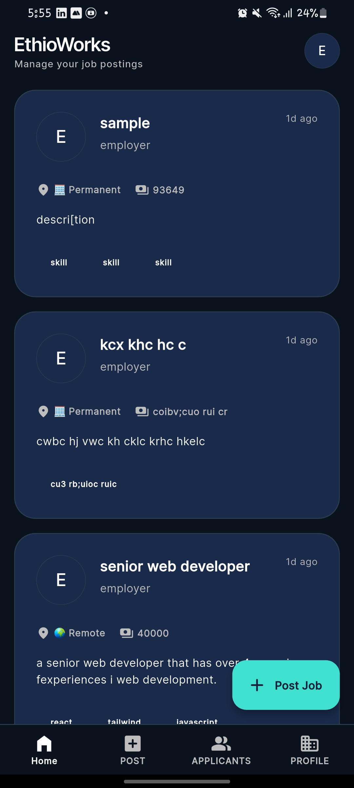
</p>
<p align="center">
  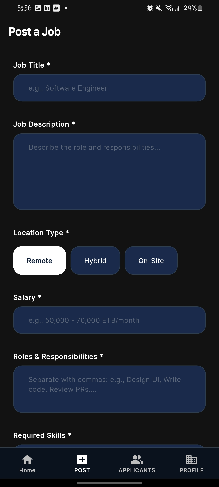
  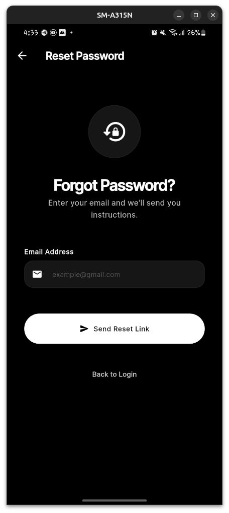
  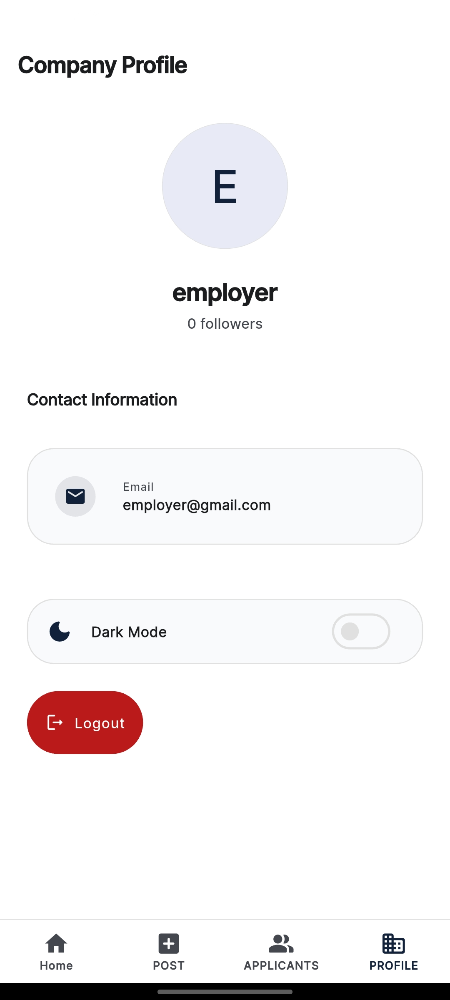
  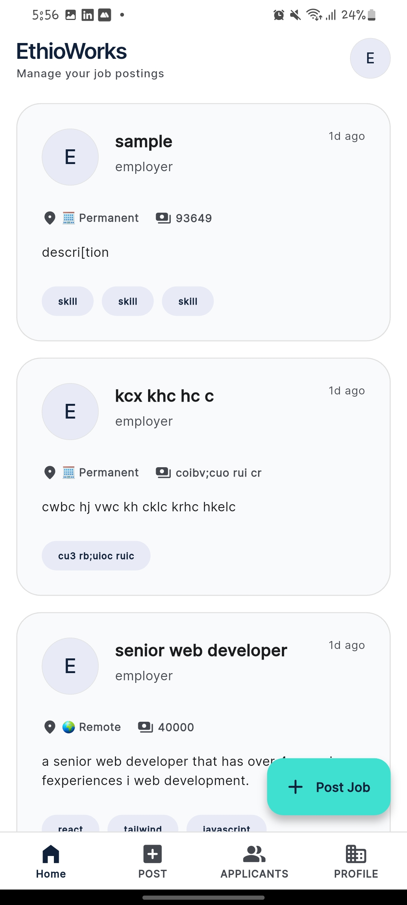
</p>
<p align="center">
  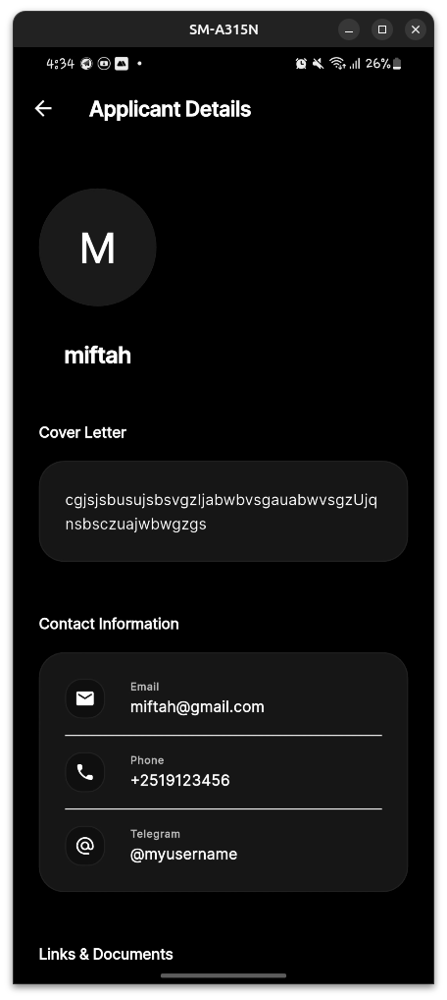
  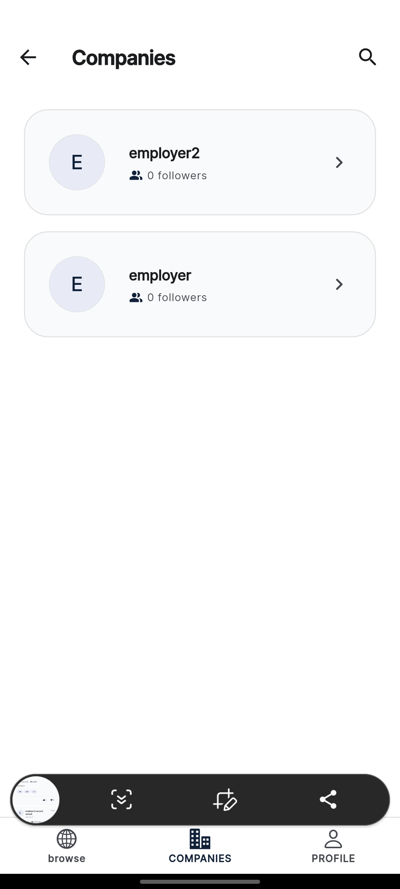
  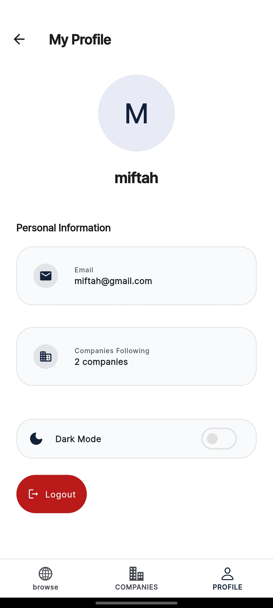
  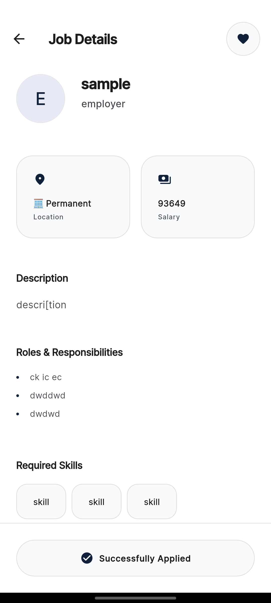
</p>

## 💻 Web & Desktop Experience

The web and desktop versions utilize the horizontal space to provide a comprehensive management interface for employers and an expansive browsing experience for seekers.

<p align="center">
  
  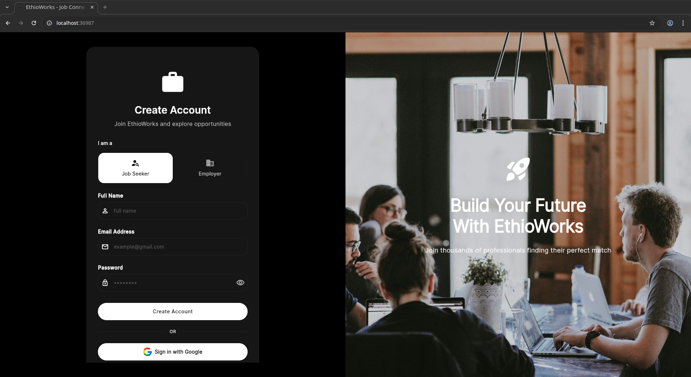
  
  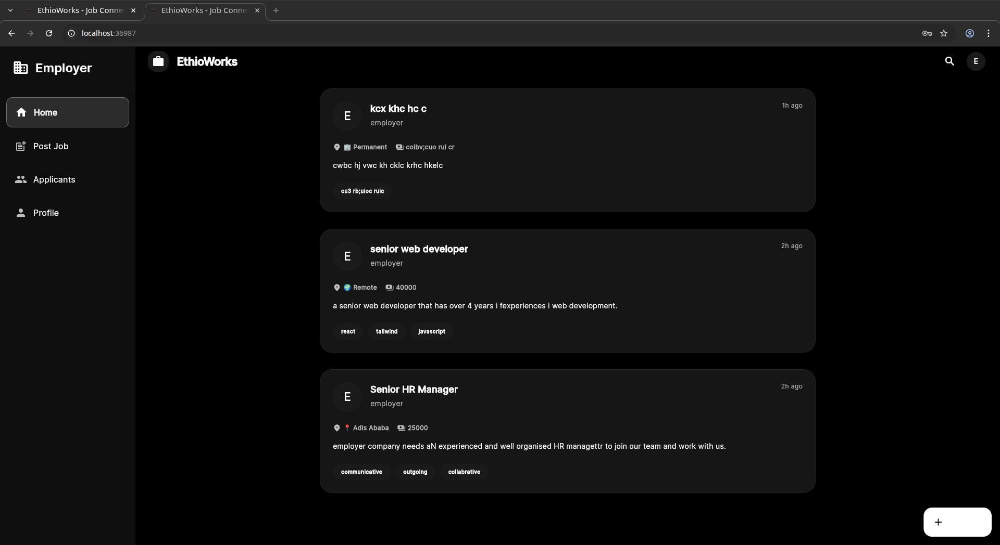
</p>
<p align="center">
  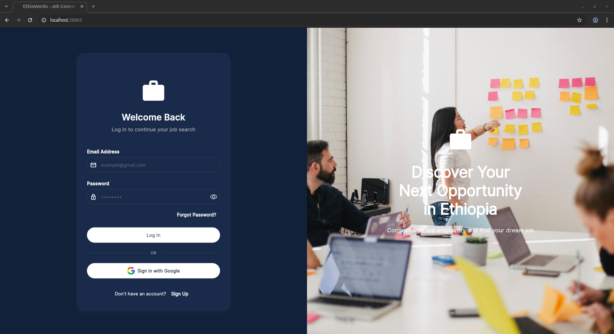
  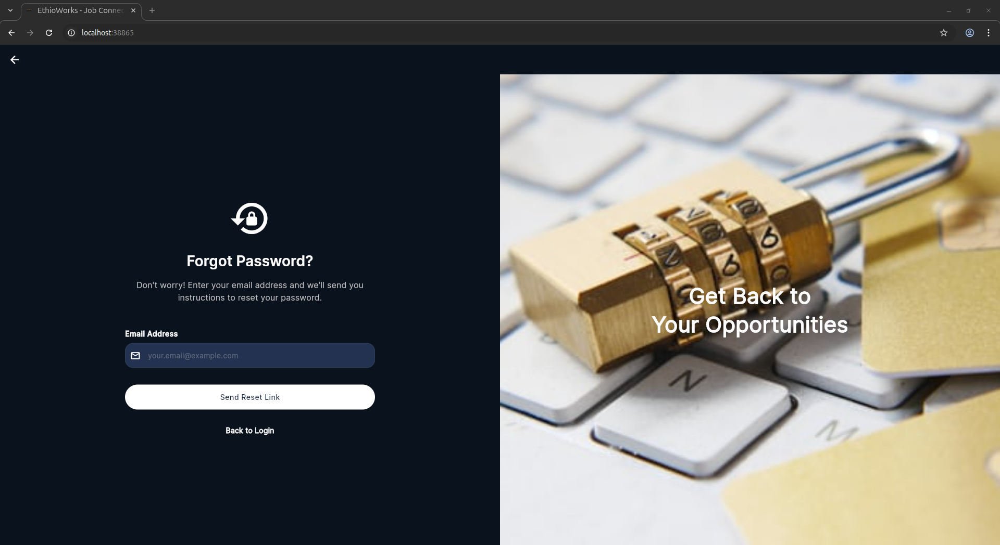
  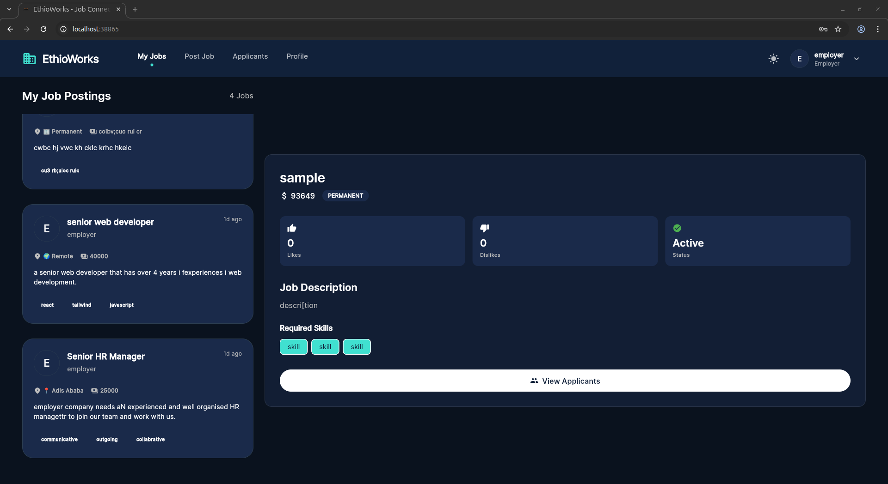
  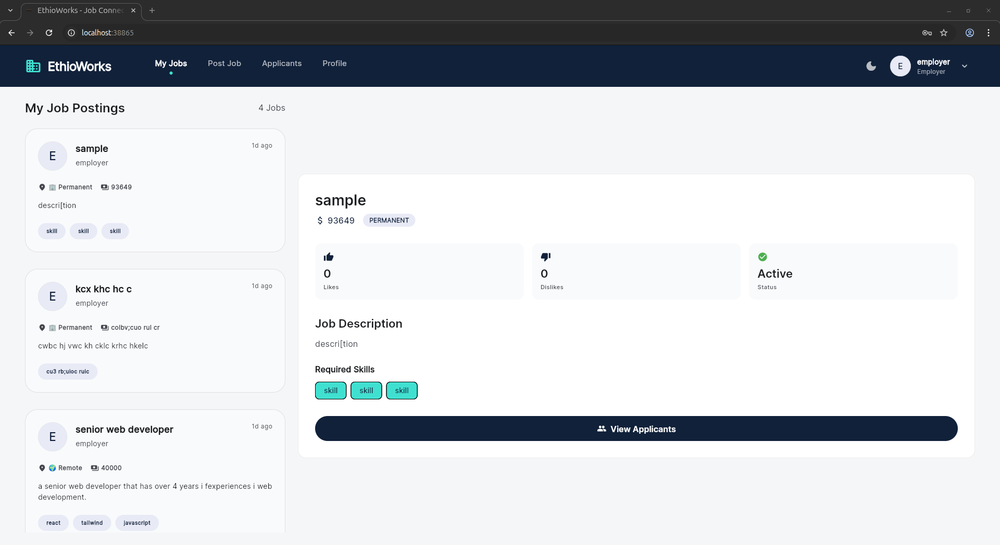
</p>
<p align="center">
  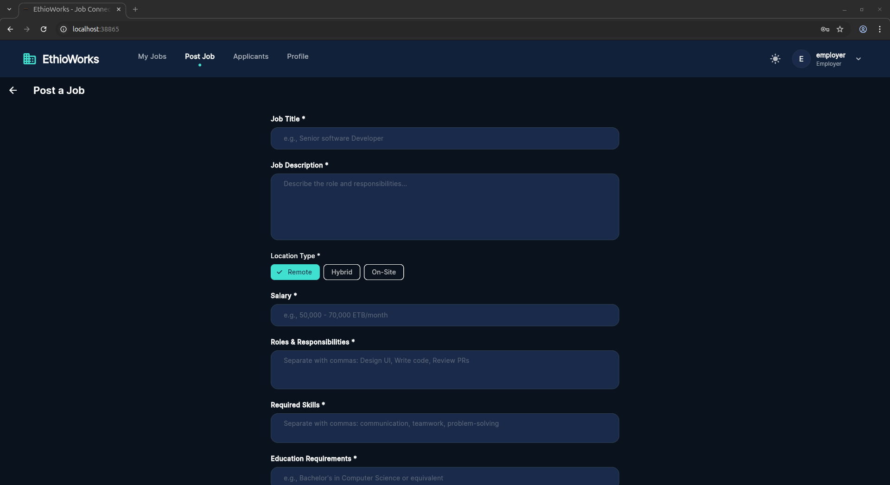
  
  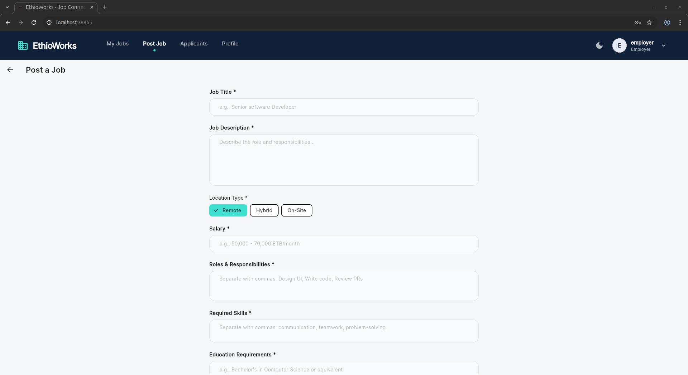
  
</p>

## 🔌 Tech Stack

- **Framework**: [Flutter](https://flutter.dev) (Single codebase for all platforms)
- **State Management**: [Provider](https://pub.dev/packages/provider)
- **Backend**: [Firebase](https://firebase.google.com) (Authentication, Cloud Firestore, Storage)
- **Design System**: Custom Vanilla CSS & Flutter Material 3
- **Responsiveness**: Custom-built `ResponsiveLayout` for seamless window resizing.

## 🚀 Getting Started

### Prerequisites
- Flutter SDK installed on your machine.
- A Firebase project configured for the application.

### Installation

1. **Clone the repository**:
   ```bash
   git clone https://github.com/your-username/EthioWorks.git
   cd EthioWorks
   ```

2. **Install dependencies**:
   ```bash
   flutter pub get
   ```

3. **Set up Firebase**:
   - Place your `google-services.json` in `android/app/`.
   - Place your `GoogleService-Info.plist` in `ios/Runner/`.
   - Run `flutterfire configure` to update options.

4. **Run the application**:
   ```bash
   flutter run
   ```

---

